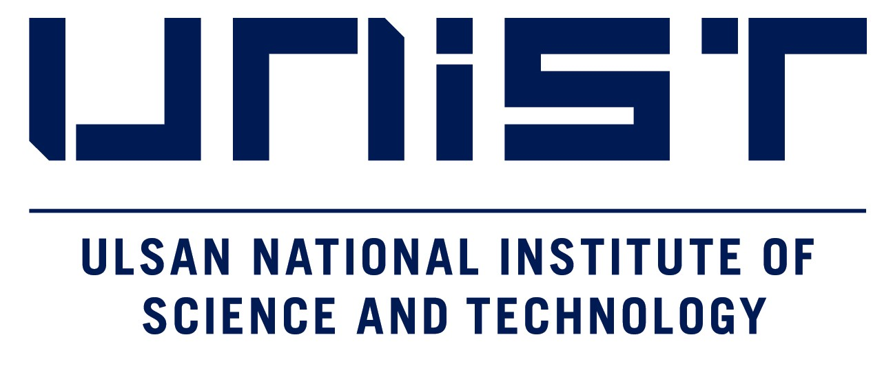
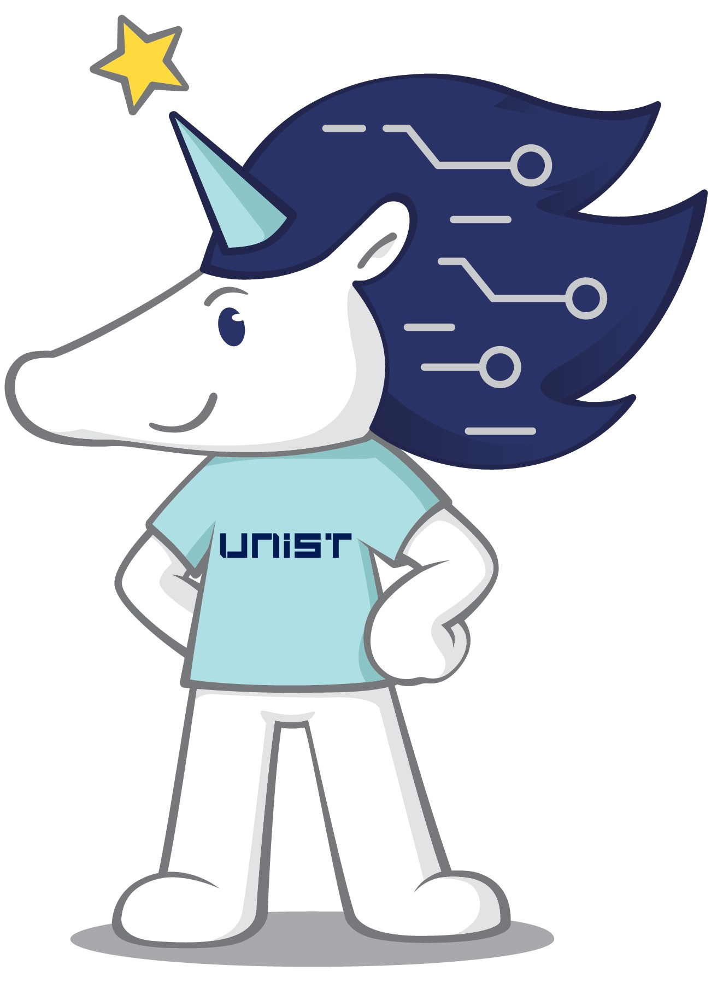

   

# **2025년 겨울방학 AI 팀프로젝트 슈퍼컴퓨팅 청소년 캠프**

본 자료는 2025년도 KISTI-UNIST 겨울 청소년캠프 Edge 디바이스를 활용한 AI 실습 강의 자료 입니다.

---
## 준비물
1. Jetson Nano or Orin Nano
2. Pytorch 개발 환경

## 기본 jetpack 설치 및 연결
```
ssh jetson@192.168.55.1
```
password: jetson

## 실습파일 다운
```
git clone https://github.com/jckim1201/25_youth_winter
```

## 카메라 확인
```
ls /dev/video0
```

## 도커파일 다운 및 실행
```
echo sudo docker run --runtime nvidia -it --rm --network host --volume ~/25_youth_winter:/nvdli-nano/data --volume /tmp/argus_socket:/tmp/argus_socket --device /dev/video0 nvcr.io/nvidia/dli/dli-nano-ai:v2.0.3-r36.3.0kr >> docker_run.sh
```
```
chmod +x docker_run.sh
```
```
./docker_run.sh
```
또는
```
cp 25_youth_winter/docker_run.sh ./
```
```
./docker_run.sh
```

---
## 참고자료

1. [Jetson AI Fundamentals](https://youtu.be/rSqIvLQ8Meg?si=45sTk7O73CtzZnAX)
2. [Nvidia AI Lab](https://www.jetson-ai-lab.com)
3. [Jetson Community Projects](https://developer.nvidia.com/embedded/community/jetson-projects)
