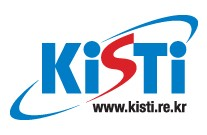

   

# **2025년 겨울방학 AI 팀프로젝트 슈퍼컴퓨팅 청소년 캠프**

본 자료는 2025년도 KISTI-UNIST 겨울 청소년캠프 Edge 디바이스를 활용한 AI 실습 강의 자료 입니다.

## 과제 내용

---
## 가위 바위 보 또는 묵 찌 빠
1. 실습 파일의 1_AI_Youth-DataCollection.ipynb 파일과 2_AI_Youth-Traning.ipynb 파일을 이용하여 묵찌빠 문제를 설정하고 훈련 하여 모델을 제출

## 제출 사항 (아래의 두 파일을 메일로 제출)
1. model_definitions.py
2. model_{조번호}.pth

## 제출 시간 및 제출 메일
-  23(목) 오후 9시(21시까지) 25youthwinter@gmail.com 으로 제출 
